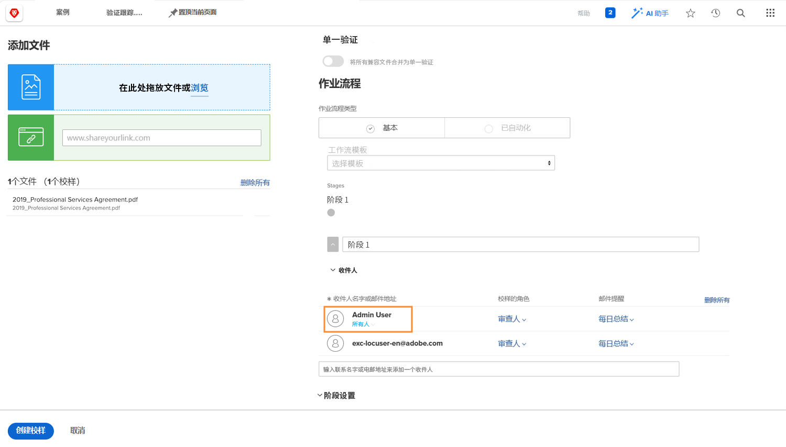

# 使用自动化工作流上传验证

在本视频中，您将了解：

* 何时可以使用自动验证工作流
* 如何使用验证模板应用工作流
* 如何从头开始设置自动化工作流

>[!VIDEO](https://video.tv.adobe.com/v/335133/?quality=12&learn=on)

## 其他验证工作流设置

验证上传窗口底部的设置是可选的，因此请与您的组织联系，查看是否以及如何使用它们。

![的图像 [!UICONTROL New Proof]带有以下内容的窗口 [!UICONTROL Stage settings] 突出显示。](assets/additional-proof-workflow-settings.png)

* **[!UICONTROL Lock stage]—** 这样可防止此工作流阶段中的人员在工作流阶段完成之后进行评论或更改决策。
* **[!UICONTROL Transfer primary decision rights to]—** 通过指定主要决策人来加快验证过程。 设置后， [!DNL Workfront] 确认此人的证明决策作为决策。 一旦这个人做出决定，阶段就结束了，不需要做出其他决定。
* **[!UICONTROL Require only one decision for this stage]—** 简化验证过程的另一种方法是只需对验证做出一个决定。 打开此选项后，无论您在该阶段有多少批准者，一旦他们中的任何人做出决定，该阶段即告完成。
* **[!UICONTROL Make this stage private]—** 默认情况下，所有阶段的每个人都可以看到有关验证的评论。 通过单击该框，防止其他阶段的验证收件人看到在此阶段所做的评论。

在验证上传窗口的底部，有多个影响验证安全性的验证设置，例如要求登录以查看验证。

<!--
Learn more about these in the Proof settings section of the Configure a proof article.
-->

![的图像 [!UICONTROL Proof settings] 验证上传窗口的区域。](assets/additional-proof-workflow-settings-2.png)

<!--
### Learn more
* Automated workflow overview
* Automated workflow stages overview
-->

<!--
### Guides
* Plan an advanced workflow worksheet
-->

## 为何选择验证工作流？

您会注意到自己位于验证收件人列表中，因为您是上传验证的人。 这也使您成为校样所有者，它授予您对校样的编辑权限，允许您更改工作流设置或上传新版本等。

如果您仅在上传验证，而其他人将管理工作流，则可以通过单击 [!UICONTROL Owner] 链接并输入其名称。 如果除原始上传程序之外的人将上传版本，则建议执行此操作。

## 轮到你了

>[!IMPORTANT]
>
>别忘了提醒你的同事，作为Workfront培训的一部分，你向他们发送了证明。

使用高级工作流上传验证。 如果您的组织已经设置了验证模板，请选择您的团队使用的模板，然后进行一些调整。

* 调整电子邮件警报，以便在验证上发生活动时不会通知任何人。
* 第一阶段应有2名审阅人/批准人。
* 第二阶段应只有1个审阅者/批准者。

如果贵组织尚未创建验证模板，请从头开始设置两阶段工作流。

* 将您自己和您喜爱的同事分配到第一阶段。
* 将第一阶段的截止日期设为创建验证后的1天。
* 将另一个收藏的同事分配给第二阶段。
* 在第一阶段的截止日期已过时启动阶段。
* 给此阶段中的人员2天以完成审查，但必须中午前完成。

