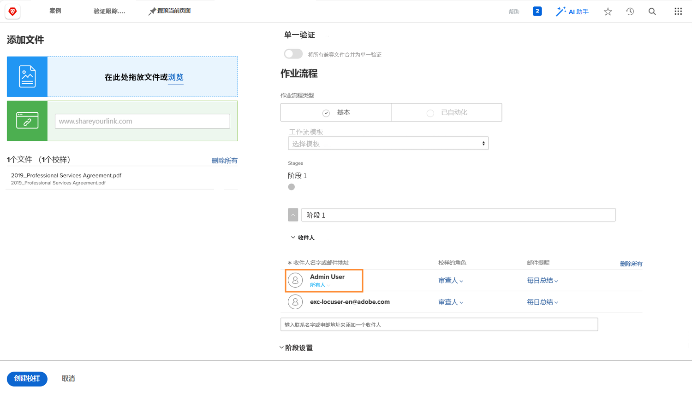

# 使用自动化工作流上传校样

在本视频中，您将了解到：

* 何时可以使用自动校样工作流
* 如何使用校样模板应用工作流
* 如何从头开始建立自动化工作流

>[!VIDEO](https://video.tv.adobe.com/v/335133/?quality=12&learn=on&enablevpops=1)

## 其他校样工作流设置

校样上传窗口底部的设置是可选的，因此请咨询您的组织，了解您是否能够以及如何使用它们。

![突出显示 [!UICONTROL Stage settings] 的 [!UICONTROL New Proof] 窗口的图像。](assets/additional-proof-workflow-settings.png)

* **[!UICONTROL Lock stage]—**&#x200B;这可以防止位于此工作流阶段内的人员在其所处的工作流阶段完成后发表评论或更改决策。
* **[!UICONTROL Transfer primary decision rights to]—**&#x200B;通过指定主要决策者来加快校对过程。 设置后，[!DNL Workfront] 会将此人作出的校样决策识别为最终决策。 在该人作出决策后，这个阶段就结束了，并且不再需要其他决策。
* **[!UICONTROL Require only one decision for this stage]—**&#x200B;简化校对过程的另一种方法是只要求对校对作出一个决策。 启用此功能后，无论该阶段有多少审批人，一旦他们其中的任何一个作出决策，该阶段就完成了。
* **[!UICONTROL Make this stage private]—** 默认情况下，所有阶段的每个人都可以看到对校样的评论。 通过单击该框，可以防止其他阶段的校样收件人看到此阶段所做的评论。

校样上传窗口的底部是一些影响校样安全性的校样设置，例如需要登录才能查看校样。

<!--
Learn more about these in the Proof settings section of the Configure a proof article.
-->

![校样上传窗口的 [!UICONTROL Proof settings] 部分的图像。](assets/additional-proof-workflow-settings-2.png)

<!--
### Learn more
* Automated workflow overview
* Automated workflow stages overview
-->

<!--
### Guides
* Plan an advanced workflow worksheet
-->

## 为什么您在校样工作流中？

您会注意到您在校样收件人列表中，这是因为您是上传校样的人。 这也使您成为校样所有者，您因此会获得对校样的编辑权限，允许您更改工作流设置或上传新版本等。

如果您只负责上传校样，其他人会管理工作流，您可以通过单击 [!UICONTROL Owner] 链接并输入其名字来更改校样所有者。 如果原始上传者以外的其他人要上传一个版本，则建议这样做。

## 到您了

>[!IMPORTANT]
>
>请不要忘记提醒您的同事，您向他们发送的校样是您 Workfront 培训的一部分。

使用高级工作流上传校样。 如果您的组织已设置校样模板，请选择您的团队使用的模板，然后进行一些调整。

* 调整电子邮件提醒，以便在校样上发生活动时不会有人收到通知。
* 第一阶段应有 2 名审阅者/审批者。
* 第二阶段应该只有 1 个审阅者/审批者。

如果您的组织还没有创建校样模板，请从头开始设置两阶段校样工作流。

* 将您自己和您最喜欢的同事分配到第一阶段。
* 将第一阶段的截止日期设为自校样创建之日起 1 天。
* 将另一位最喜欢的同事分配到第二阶段。
* 当第一阶段的截止日期过后，让该阶段开始。
* 给这个阶段的人 2 天的时间来完成审阅，但必须在中午之前完成。

